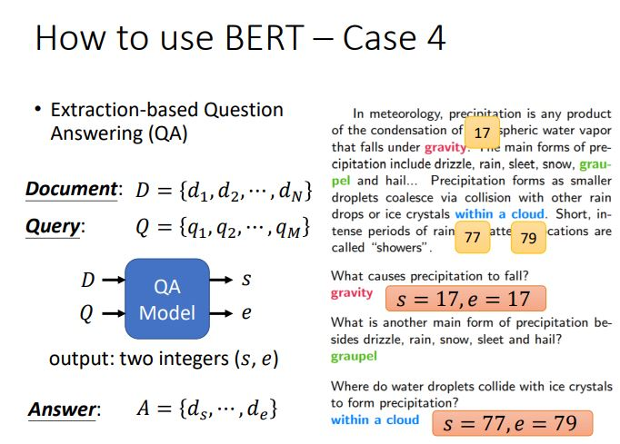
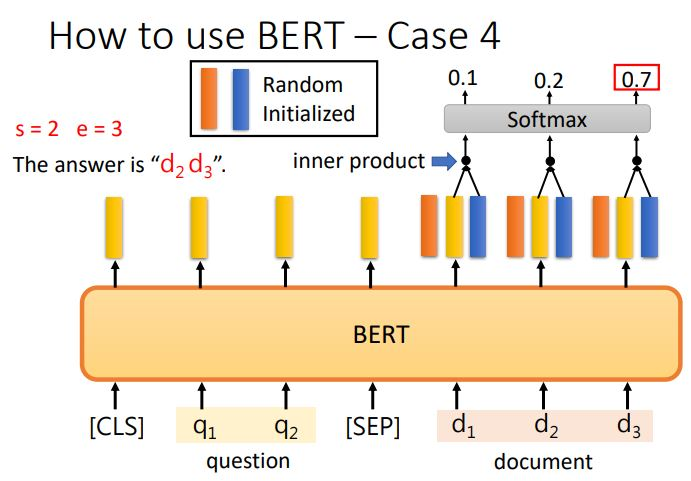
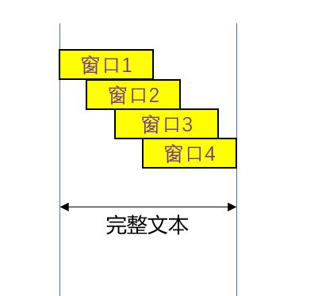

李宏毅上课的第7个作业，就是微调一个问答系统。给出一段话，回答几个问题，问题的答案都在段落里面。

<!--more-->

## 任务介绍

先前介绍BERT应用的时候，其实已经提了一嘴。整个模型的输入是段落和问题，输出是答案在段落的起止点。



它的具体实现，其实就是在一个与预训练好的tokenizer和BERT基础上，再训练两个向量而已。第一个随机向量与BERT的各个输出做点积，然后对文档的输出做softmax，取最大值，对应下标就是输出s；另一个随机向量输出的就是e。



## 代码整体逻辑介绍

在transformer中，这整个模型其实已经被封装起来了，只需要调用一个BertForQuestionAnswering，就可以获得这整个模型。而每一个预训练好的bert都对应一个tokenizer，就是把句子转换成一个个单独词向量的工具。

- 准备环境。设置好输入输出工作目录，设置随机数种子，方便复现
- 设置tokenizer和bert模型的预训练设置
- 设置Dataset和loader
- 定义检验结果函数以及训练过程
- 测试结果输出与保存

其中，本文涉及到的代码只是从样例代码里修改。首先，把sample code适配到我的目录后，准确率达到50.0%。适配过的sample code见此链接。把各自输入输出目录匹配以后，一品丹药就炼好了，因为正确率太低，只要吸收药力就会爆体而亡。

## 炼丹手段

首先说一下结果，最后我在private score上的结果是83.5，也懒得继续炼丹让它超过85.1了。毕竟不知道别人用的是什么样的模型，研究这个也没意思，到前10%就不玩了。

### 学习率调节

原本使用的是恒定的1e-4的学习率，经过测试恒定的学习率在这个系统中，会导致学得慢，最后也学不精。助教推荐了两种做法，一种是线性往下的学习率，另一种是先有个warmup的过程再线性向下走。我采用的是带warming up的学习率，放张官网的图片。


加了下面这些代码，正确率提高到59.7%。虽然这里看来错误率降低了20%，也是不错的手段，但由于我们现在也只用了1个epoch，结合数据其实可以知道模型是不够拟合。调节了学习率，现在看了就是让它训练的更快一点。

```python
warmup_rate = 0.1
total_step = math.ceil(len(train_set) // train_batch_size) * num_epoch

# 在定义optimizer后再定义scheduler，
optimizer = AdamW(model.parameters(), lr=learning_rate)
scheduler = get_linear_schedule_with_warmup(
    optimizer, num_warmup_steps = total_step * warmup_rate, num_training_steps = total_step
)

# 在每次optimizer执行后，需要执行scheduler，执行step其实只是调整optimizer的学习率而已。
optimizer.step()
scheduler.step()
optimizer.zero_grad()
```

### 测试窗口调节优化

首先在这里什么是窗口，由于bert的输入不可能能把整篇文章输入进去。我们也看到了，self-attention机制使用到了全连接的方式实现，所以bert里有一个软上限的大小就是512。因为在模型里面，每一层就要存储至少512*512个参数，当模型堆叠起来的时候，本身就已经变得很大。在不同的时期窗口有不同的用法，训练阶段和测试阶段用的窗口是完全不同的两种。

这里先说测试阶段，因为在助教的ppt里面，学习率调节和窗口调节都是Medium难度的一部分。虽然我实作的时候都忘了先调哪个后调哪个的，但现在还是按着他ppt来吧。

测试阶段，我们不知道在这么长的段落里，到底哪一块是答案。因此使用的是滑动窗口的机制，从起点开始定义固定的窗口长度为max_paragraph，然后不断地向右移动窗口。



```python
        self.max_question_len = 40
        self.max_paragraph_len = 150
        self.doc_stride = 75

```

每个窗口滑动的距离就是doc_stride，因为我从段落上直观感受，150的max_paragraph已经是足够了，所以就搜索了一下在调节学习率后，发现最高的是doc_stride=75。经历了学习率调节和测试窗口调节之后，准确率提高到了71.4%，也是Medium的调节参数项目吧。

嗯，这样三品丹药就炼完了，71的正确率，让丹药服用后不会爆体而亡了，只是丹药还是没有作用。

### 训练窗口优化

其实，我看排行榜所有人都能做到前面的内容，这里后面就是真正能拉开差距的项目了。训练窗口其实就是把那些段落内容作为训练样本放到机器学习中，毕竟一个段落老长了，我们也只能放一点点进去。原本的做法是讲段落围绕答案展开，从答案中间用相等的长度扩展到两边。也就是如下面的代码：

```python
    # 在段落中找到答案，然后左右均匀扩展到上限长度
    mid = (answer_start_token + answer_end_token) // 2
    paragraph_start = max(0, min(mid - self.max_paragraph_len // 2, len(tokenized_paragraph) - self.max_paragraph_len))
    paragraph_end = paragraph_start + self.max_paragraph_len
```

然而，这样的做法很显然表现会比较差，因为它学习了一个无用特征，就是答案在段落中间。然而，在预测的时候，答案可不会只在中间，它可能在任何位置。所以这样的数据，其实就把模型给坑了。

定义这一部分的在Dataset里面，每次取数据都会取从中间扩散的区间。其实改造方法很简单，就是把中间扩散，改为随机扩散即可，具体实现还是看代码吧，当时也推了一阵子式子的。找左区间哪些范围合法就行了，右区间直接加上长度，这样最符合随机特点。

```python
    paragraph_start = np.random.randint(low=max(0, answer_end_token - self.max_paragraph_len), high=min(len(tokenized_paragraph) - self.max_paragraph_len, answer_start_token) + 1)
    paragraph_end = paragraph_start + self.max_paragraph_len
```

在这之后，正确率提高到了75%。减少了20%错误率，提升很显著。

### 学习率和epoch调节

即便瞎调节一通学习率后，有时模型还是学的不是那么完善，所以还是得调整一下最高学习率和epoch数量。特别是我们把训练窗口调成了随机之后，相当于做了一次数据增强。所以数据增强就用数据增强的办法，增加epoch的数量，降低学习率。并且，在训练过程中，要保存多几个模型，最后生成多几次的测试文本，毕竟很容易过拟合。我的参数这样：

```python
    num_epoch = 5
    validation = True
    logging_step = 100
    learning_rate = 1e-4 / 4
    warmup_rate = 0.1
```

调节了这个之后，把正确率冲击到了78%，减少了15%左右错误率，提升很明显。到这里已经很接近strong base line了，还有好几个杀手锏还没用，我到这里已经很放心了，肯定能稳过了。毕竟看Leader board，到boss baseline的人很少，而且很接近，应该是用了些比较大的模型还有各种参数搜索什么的。所以也懒得去冲击了。

### 修复start>end

在ppt里的提示，我们看生成的答案，能看到有一大堆空信息，这里是我们可以优化的点。其实方法很简单，就是在每次output中得说明好哪一些output是合法的就好。

然后顺便把一些带不太对劲的标点符合给判定为不合法。

```python
if prob > max_prob and start_index <= end_index and start_index > sep_index[0].item() and end_index < sep_index[1].item():

    answer = tokenizer.decode(data[0][0][k][start_index : end_index + 1])
    if re.match(".*[。？?；;]+", answer):
        continue
```

### 更换预训练资料

bert模型各种参数什么的都不一样，选择预训练的模型也很重要。由于找哪个预训练模型合适，这个过程太过无趣，所以就看csdn上“梆子井欢喜坨
”的[文章](https://blog.csdn.net/qq_39610915/article/details/119913009#45__329)，然后随便换了几组模型。

我和他的测试结果完全不一样，他测试的结果没有提高很多，但我的却提升十分显著。基于上面的优化的结果：

|模型|private score|
|--|--|
|bert-base-chinese|0.78681|
|hfl/chinese-roberta-wwm-ext|0.80401|
|luhua/chinese_pretrain_mrc_roberta_wwm_ext_large|0.82922|

其实这里已经能过strong base line了，但我们还有一些可以优化的点。

### 未知字符修复

这个可能代码说明起来比较复杂，所以只作语言上的描述。在答案里面，我们能看到有一些[UNK]的字符输出，这应该是有一些生僻繁体字的问题，而学习的模型应该是以简体字为主的。

对付这个问题，我们可以用正则表达式的方法。在测试集测试结果的时候，把段落也塞进evaluate函数中。然后把截取的窗口中，切分成目标前、目标、目标后三段，然后组成正则表达式`.*目标前(目标)目标后`，然后把这里所有的特殊字符，包括`[UNK]`和`#`转义成'.*'。

```python
    regex = f".*{form(tokenizer.decode(data[0][0][k][sep_index[0].item() + 1 : start_index]))}" + 
    f"({form(tokenizer.decode(data[0][0][k][start_index : end_index + 1]))})"+ 
    f"{form(tokenizer.decode(data[0][0][k][end_index + 1 : sep_index[1].item()]))}"
```

接着注意，在答案里很可能出现形如`[UNK][UNK][UNK][UNK][UNK][UNK]`这样的连续未知字符，如果全部转义成`.*`的话效率过慢。可以先洗一洗生成的正则表达式：

```python
    regex = re.sub(r'[.*]+', '.*', regex)
```

接着直接匹配结果就好

```python
    re_result = re.match(regex, paragraph)
        if re_result is not None:
            answer = re.match(regex, paragraph).group(1)
```

其实代码里面改了不少dataset之类的，改完之后扔上kaggle。结果是83.6%。也还算是一个满意的结果了。毕竟最高的也就86%，到这里稳稳地过线，而且也已经完全理解代码了。

### 总结

用一张表总结中途的心路历程

|优化方法|private score (percent)|
|--|--|
|sample code|50.0|
|学习率曲线调节|59.7|
|测试窗口优化|71.0|
|训练窗口优化|75.0|
|训练参数调整|78.6|
|start>end修复|-|
|大模型运用|82.9|
|未知字符修复|83.6|

### 展望

其实我还有一些想法没有实现，比如标点符合判断上，我采用了直接砍掉的做法。这样的做法是不对的，因为除了最大的start/end我还可以找第二大、第三大。

应该可以将数组按照句号什么的切分，然后单独计算。感觉直接把句子干掉的话，正确率可能会有些损失。不过，即便改好了，感觉也不可能冲击到boss baseline，所以就没改了。冲击boss baseline肯定还得有别的东西，才能有那么大幅度的提升。
